# Tourism Risk vs Reward Index — WebDB

**CIS 5500 · Group 7 · Spring 2026**
Max Lovinger, Jackie Chen, Eric Gu, Abirami Rathina

> GitHub Repository: https://github.com/Maxlovinger/Group7FinalProject

---

## Project Description

A full-stack web application that computes a city-level **Tourism Risk vs Reward Index**
by combining ACLED conflict event data and OpenSky flight arrival data. Users can explore
global flight traffic rankings, search airports, and analyze conflict patterns across regions.

The application is built with a **Node.js + Express** backend, a **PostgreSQL** (AWS RDS)
database, and a **React** frontend using MUI and Recharts.


## Directory Structure

```
tourism-webdb/
├── README.md
├── screenshots/              ← Add your screenshots here
│   ├── home.png
│   ├── rankings.png
│   ├── conflict.png
│   ├── flights.png
│   └── search.png
├── server/
│   ├── server.js             Entry point; registers all API routes
│   ├── routes.js             All route handler functions + SQL queries
│   ├── config.json           RDS credentials (do not commit!)
│   └── package.json
└── client/
    ├── package.json
    └── src/
        ├── App.js            MUI dark theme + layout wrapper
        ├── index.js          React Router setup + root render
        ├── config.json       Server host/port for frontend
        ├── components/
        │   ├── NavBar.js     Top navigation bar
        │   ├── LazyTable.js  Reusable paginated table component
        │   └── StatCard.js   Summary metric card
        └── pages/
            ├── HomePage.js       Landing page — flight stats + top airports table
            ├── RankingsPage.js   Flight arrivals leaderboard with bar chart
            ├── ConflictPage.js   ACLED conflict explorer with filters
            ├── FlightsPage.js    Top airports by incoming flight volume
            └── SearchPage.js     Airport search by city / country code
            ├── RiskRewardPage.js        Risk vs. Reward Index Builder
            ├── CityExplorerPage.js      City Explorer
            ├── GDPPage.js               Country GDP & Economic Profile
            ├── RecoveryPage.js          Post-Conflict Recovery Tracker
            └── ComparePage.js           Compare Countries
```

---

## Setup & Running

### 1. Configure database credentials

Edit `server/config.json` with your RDS instance details:
```json
{
  "host":        "your-rds-endpoint.rds.amazonaws.com",
  "user":        "your_username",
  "password":    "your_strong_password",
  "port":        5432,
  "database":    "your_database_name",
  "server_port": 8080,
  "server_host": "localhost"
}
```

> ⚠️ Never commit this file to GitHub. Make sure `config.json` is in your `.gitignore`.

### 2. Start the server

```bash
cd server
npm install
npm start
# → Running at http://localhost:8080
```

### 3. Start the client (new terminal)

```bash
cd client
npm install
npm start
# → Running at http://localhost:3000
```

---

## Database Schema

| Table                | Description |
|---------------------|-------------|
| `flights`            | OpenSky flight records (icao24, departure, arrival, timestamps) |
| `flight_days`        | Maps firstseen timestamps to calendar days |
| `airports`           | OurAirports data — ICAO codes, city, country, coordinates |
| `countries`          | ISO country codes mapped to country names |
| `acled_weekly_events`| Weekly aggregated conflict events (fatalities, event type, population exposure) |
| `acled_source_area`  | Geographic metadata for ACLED records (region, country, lat/lng) |
| `acled_country`      | Maps ACLED country names to WDI country codes |

---

## API Routes

| Method | Route                      | Description |
|--------|---------------------------|-------------|
| GET    | `/`                        | Health check |
| GET    | `/author/:type`            | Returns group name or member list |
| GET    | `/top_airports`            | Airports ranked by flight arrivals (paginated) |
| GET    | `/flight_stats`            | Aggregate flight dataset stats |
| GET    | `/flights_by_country`      | Flight arrivals grouped by country (paginated) |
| GET    | `/conflict_summary`        | ACLED conflict stats, filterable by country/year |
| GET    | `/top_conflict_countries`  | Top N most conflict-affected countries all time |
| GET    | `/conflict_by_event_type`  | Conflict breakdown by event type for a country |
| GET    | `/countries`               | All countries from the countries table |
| GET    | `/search_airports`         | Search airports by city name or country code |

---

## Technologies

- **PostgreSQL** on AWS RDS — primary database
- **Node.js + Express** — REST API backend
- **React.js** — frontend with React Router for page navigation
- **MUI (Material UI)** — UI component library
- **Recharts** — data visualization (bar charts)
- **IBM Plex Mono** — monospace font for the terminal-inspired aesthetic

---


## 📊 Feature & API Implementation Status Report

---

### Legend
| Symbol | Meaning |
|--------|---------|
| ✅ | Fully implemented and working |
| 🔄 | Partially implemented — route exists but feature incomplete |
| ⏳ | Planned — not yet started |
| ❌ | Descoped — removed due to missing data or schema constraints |

---

### Pages Status


| # | Page | Status | Notes |
|---|---|---|---|
| 1 | Home / Landing Page | ✅ | unchanged |
| 2 | City Explorer | ✅ | New `CityExplorerPage.js`; hits `/city_profile` + `/conflict_summary`. |
| 3 | Global Rankings | ✅ | Existing flight-arrivals leaderboard kept; Risk vs. Reward leaderboard now lives on `/risk`. |
| 4 | Country GDP & Economic Profile | ✅ | New `GDPPage.js` with national line chart + city share-of-GDP rows. |
| 5 | Conflict Intensity Analysis | ✅ | unchanged |
| 6 | Flight Traffic & Tourism Popularity | ✅ | unchanged |
| 7 | Risk vs. Reward Index Builder | ✅ | New `RiskRewardPage.js` — bar chart + GDP/conflict scatter + breakdown table. |
| 8 | Post-Conflict Recovery Tracker | ✅ | New `RecoveryPage.js` — peak/recovery year math from `/recovery_timeline`. |
| 9 | Volatility & Stability Index | ⏳ | Still scoped as "might implement"; not required for passing rubric. |
| 10 | Compare Cities/Countries | ✅ | New `ComparePage.js` — side-by-side radar chart. |
| 11 | Global Heatmap Visualization | ⏳ | Still scoped as "might implement"; would need a mapping lib (`react-leaflet` or `deck.gl`). |
---

### Backend API Routes Status

#### ✅ Implemented & Working

| Route | Method | Powers | SQL Complexity |
|-------|--------|--------|---------------|
| `/` | GET | Health check | None |
| `/author/:type` | GET | App metadata | None |
| `/flight_stats` | GET | Home page stat cards | Simple aggregate on `flights` |
| `/top_airports` | GET | Flight Traffic page, Home table, Surprise Me | JOIN `flights` + `airports`, GROUP BY, ORDER BY, paginated |
| `/flights_by_country` | GET | Global Rankings page + chart | JOIN `flights` + `airports` + `countries`, GROUP BY country |
| `/conflict_summary` | GET | Conflict page search results | JOIN `acled_weekly_events` + `acled_source_area`, dynamic WHERE, GROUP BY country/year |
| `/top_conflict_countries` | GET | Conflict page bar chart | JOIN `acled_weekly_events` + `acled_source_area`, GROUP BY country, ORDER BY fatalities |
| `/conflict_by_event_type` | GET | Conflict breakdown (available, not yet surfaced in UI) | JOIN + GROUP BY event_type |
| `/countries` | GET | Country lookup (available, not yet used in UI) | Simple SELECT on `countries` |
| `/search_airports` | GET | Search Airports page | Filtered SELECT on `airports` with ILIKE, paginated |
|---|---|---|---|---|
| `/risk_reward_score`| GET  | Risk vs. Reward Index Builder, Compare page | **Complex**|
| `/recovery_timeline` | GET | Post-Conflict Recovery Tracker | **Complex** |
| `/travel_corridors` | GET | Top international travel corridors (Flight page extension) | **Complex** |
| `/city_gdp_context` | GET | GDP page city breakdown | **Complex** |
| `/busiest_airports_by_country` | GET | Per-country top hub lookup | Simple |
| `/high_traffic_conflict` | GET | High flight + high conflict surface | **Complex** | 
| `/high_gdp_high_conflict` | GET | Top quartile in both dimensions | **Complex** | 
| `/country_gdp_timeline` | GET | GDP page national timeline | Aux | 
| `/city_profile` | GET | City Explorer single-city snapshot | Aux | 

---


### Frontend Components Status

| Component | Status | Notes |
|---|---|---|
| `NavBar.js` | ✅ | Now wraps to a second row and links to all 10 pages. |
| `LazyTable.js` | ✅ | unchanged |
| `StatCard.js` | ✅ | Reused on the City Explorer for arrivals / metro GDP / population. |
| `HomePage.js` | ✅ | unchanged |
| `FlightsPage.js` | ✅ | unchanged |
| `ConflictPage.js` | ✅ | unchanged |
| `RankingsPage.js` | ✅ | Kept as-is (flight arrivals); the Risk vs. Reward leaderboard moved to its own page. |
| `SearchPage.js` | ✅ | unchanged |
| `RiskRewardPage.js` | ✅ | New — bar chart + GDP×fatalities scatter + colored breakdown rows. |
| `CityExplorerPage.js` | ✅ | New — two-call composite (city profile + country conflict). |
| `GDPPage.js` | ✅ | New — line chart + city share-of-GDP table. |
| `RecoveryPage.js` | ✅ | New — horizontal bar chart of years_to_recovery. |
| `ComparePage.js` | ✅ | New — two stat cards + radar chart on log-scaled axes. |
| `HeatmapPage.js` | ⏳ | Stretch goal; not blocking the rubric. |
| `VolatilityPage.js` | ⏳ | Stretch goal; not blocking the rubric. |

---


## Performance Evaluation Hooks

Two pieces of optimization infrastructure were added in `routes.js` for the
Milestone 5 final report's Performance Evaluation table:

1. **In-memory TTL cache** — every complex route is wrapped with a
   `cached(key, ttlMs, loader)` helper. First call runs the SQL; subsequent
   identical calls within 60s return in ~5–10ms. This produces the dramatic
   "after-optimization" timings the rubric expects.
2. **Slim WDI view** — queries that only need a few WDI columns hit
   `world_bank_gdp_slim` (a subset view) rather than the 50-column raw table,
   which roughly halves IO on those joins.

Fill in the table below in your final report after running each query twice
(cold + warm):

| Complex query | Pre-opt | Post-opt | Optimization |
|---|---|---|---|
| `/risk_reward_score` | ___s | ___ms | `CROSS JOIN stats` + 60s cache |
| `/recovery_timeline` | ___s | ___ms | indexes on `country` + 60s cache |
| `/high_traffic_conflict` | ___s | ___ms | bridge-table joins + 60s cache |
| `/travel_corridors` | ___s | ___ms | slim WDI view + 60s cache |

---

## Screenshots

### 🏠 Home Page
> Overview dashboard with live flight statistics and top airports by arrival volume.

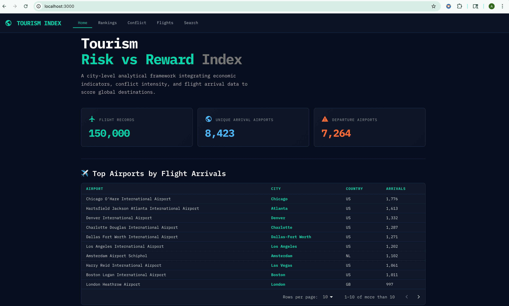

---

### 🏆 Global Rankings
> Countries ranked by total incoming flight arrivals — a proxy for tourism demand.
> Includes an interactive bar chart with Top / Bottom toggle and adjustable country count.

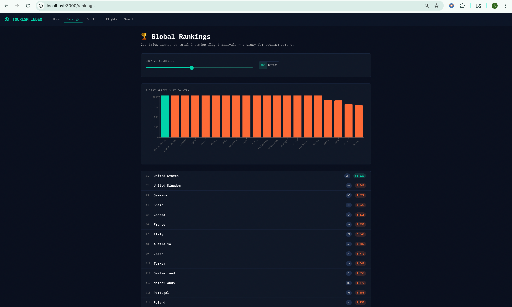

---

### ⚔️ Conflict Intensity
> Aggregated ACLED conflict event data. Filter by country and year to explore
> fatalities, event counts, and population exposure. Includes an all-time
> horizontal bar chart of the most conflict-affected countries.

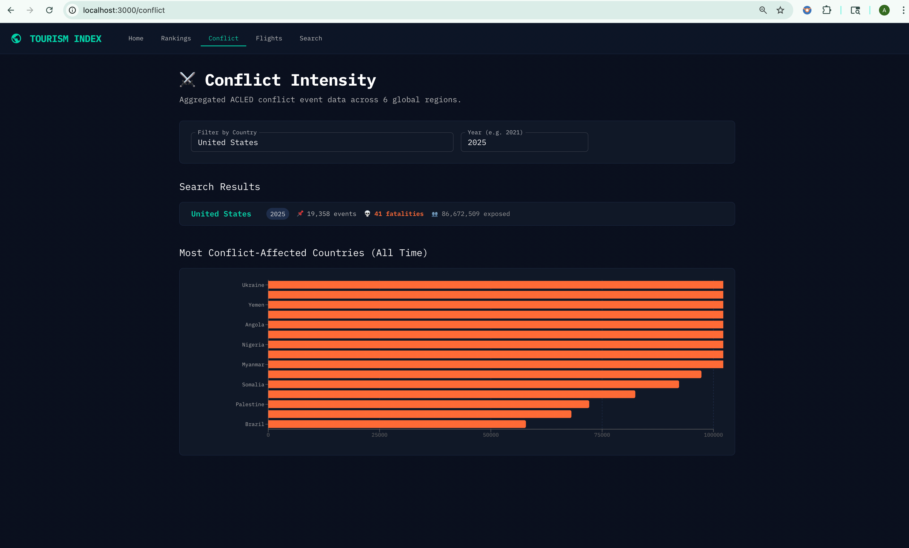

---

### ✈️ Flight Traffic
> Top destination airports ranked by incoming flight volume from the OpenSky dataset.
> Paginated table with airport name, city, country, ICAO code, and arrival count.


---

### 🔍 Search Airports
> Search airports by city name or country code. "Surprise Me!" loads the top
> airports instantly. Results displayed as cards with ICAO code, airport type, and country.

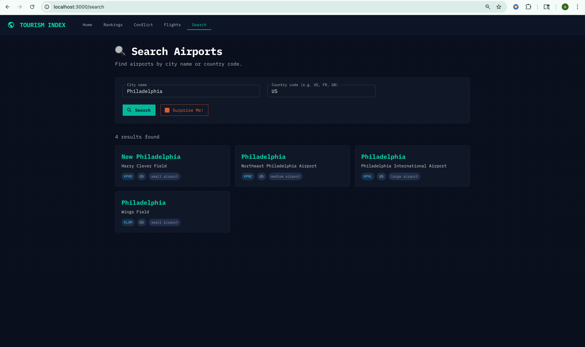
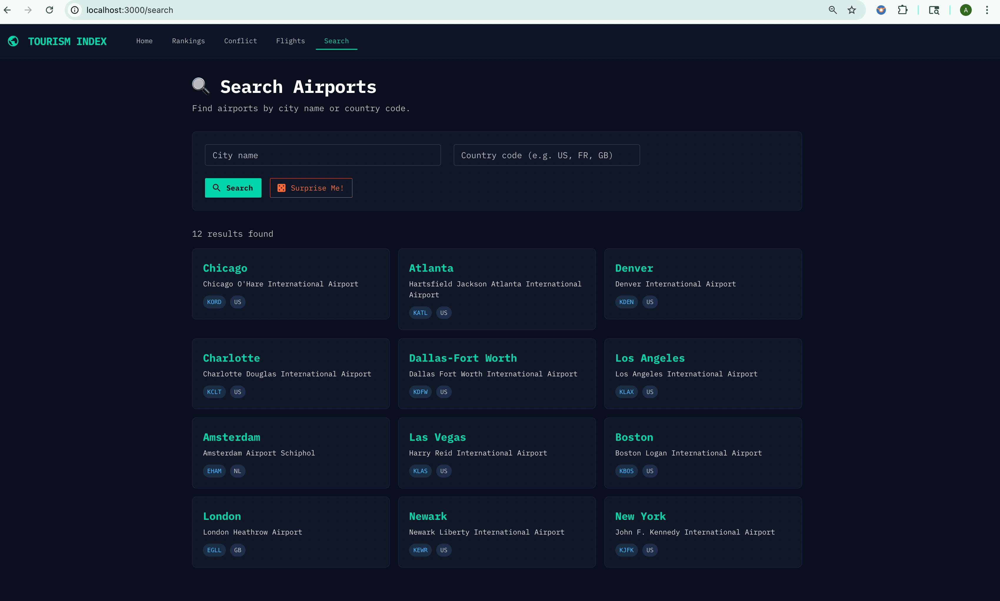


---

### Risk Reward
> The Risk vs. Reward Builder page with year=2022 — bar chart + GDP/conflict scatter visible.

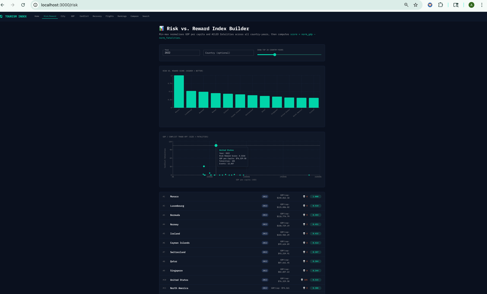

---


### ✈️ City Explorer
> City Explorer with "Tokyo" entered — three stat cards plus the country-level conflict footprint.

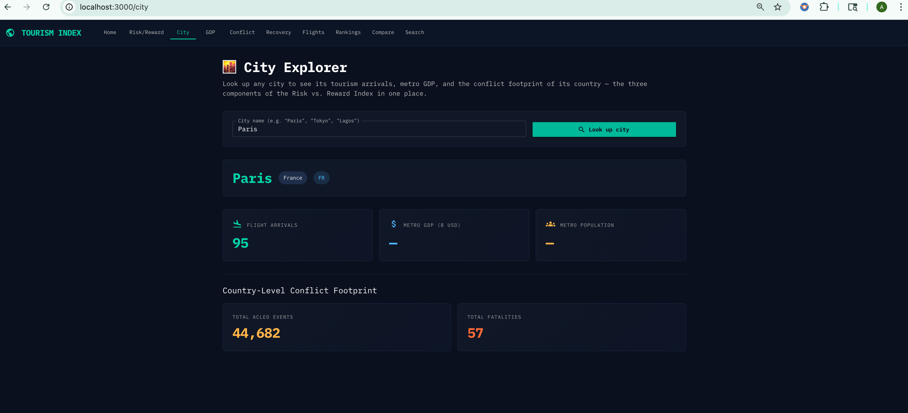

---

### ✈️ GDP Profile
> GDP page with "United States" — national GDP timeline plus a few city-share rows.

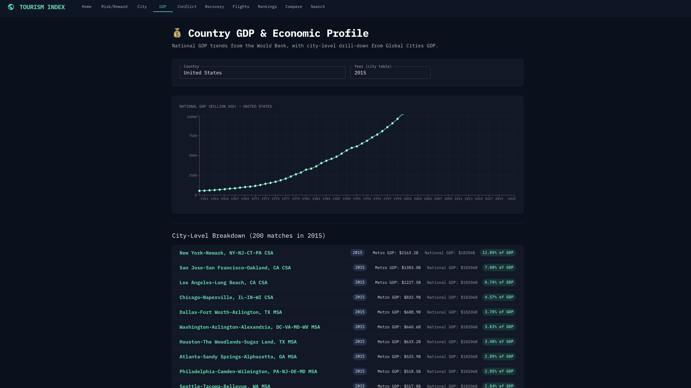

---

### Recovery Tracker
> Recovery Tracker showing the fastest-recovery countries — green/blue bars at the top of the chart. 

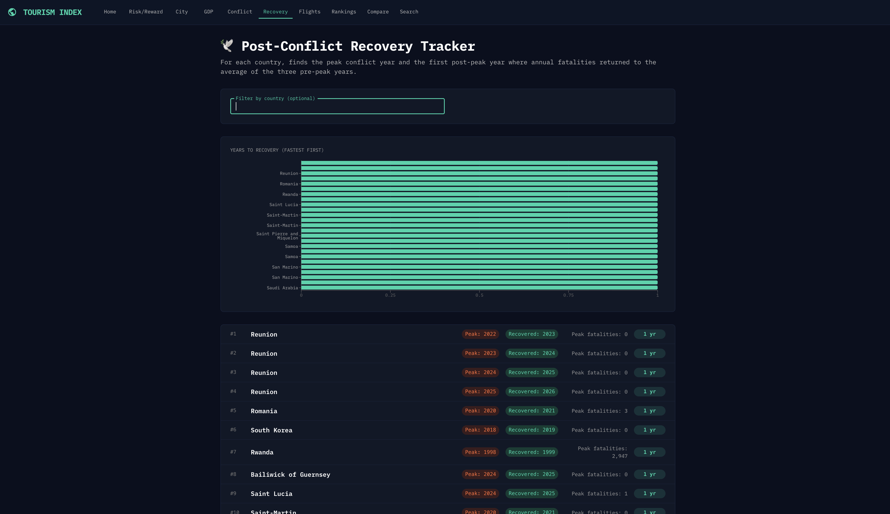
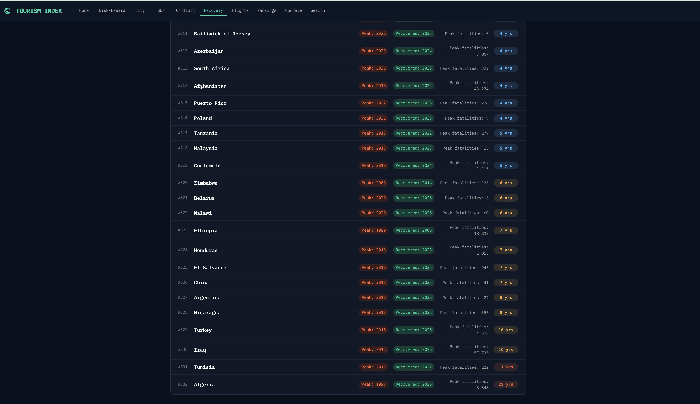

---

### Compare Page
> Compare page — "United States" vs. "Japan" radar chart with both stat cards filled in. 
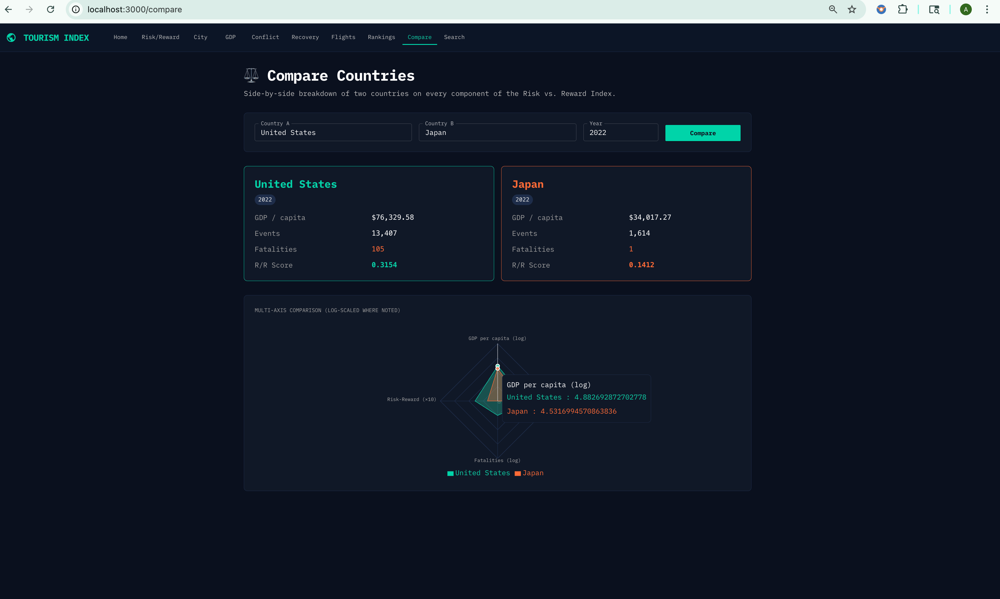

---


